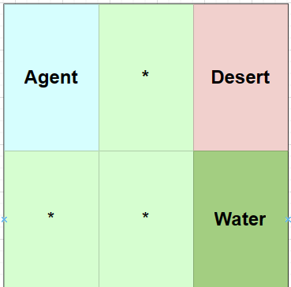

# Reinforcement Learning with Human Feedback 🤖

The problem we want to solve with [q-learning.py](./examples/q-learning.ipynb) is to find the optimal policy for an agent to navigate a 2D grid world of size 2x3. Suppose, the agent is a robot that can move in four directions: up, down, left, and right. The agent starts at the top-left corner of the grid and the goal is to reach the bottom-right corner. The agent wants to drink the water which is placed at the bottom-right corner of the grid. 

Fig a. Agent wants to navigate to the bottom right corner of the grid.

